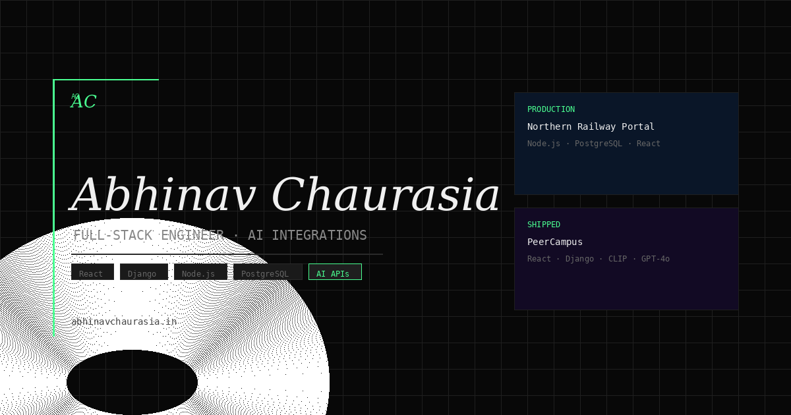

# Abhinav Chaurasia Portfolio

[Live: abhinavchaurasia.in](https://abhinavchaurasia.in)

Personal portfolio website where I present shipped full-stack work, AI integrations, and architecture decisions with code-level clarity.


---

## Preview



Live site: [https://abhinavchaurasia.in](https://abhinavchaurasia.in)

Primary profile identity:

- Developer: Abhinav Chaurasia
- Role: Full-Stack Engineer · AI Integrations
- Location: Lucknow, India

Repository:

- GitHub: [https://github.com/abhinavchaurasia-dev/portfolio](https://github.com/abhinavchaurasia-dev/portfolio)

What the preview represents:

- Home layout with compact, engineering-focused sections
- Work and projects surfaced with status-driven presentation
- Technical writing entry points with MDX-backed pages
- Metadata-ready Open Graph image used for link previews

Audience intent:

- For recruiters: quick proof of shipped systems, role scope, and technical ownership.
- For engineers: implementation depth through ADRs, architecture notes, and integration details.

Work and projects showcased in the portfolio:

| Item | Context | Stack Snapshot |
| --- | --- | --- |
| Northern Railway Portal | Internship project (Northern Railway) | Node.js, Express, PostgreSQL, React, MUI |
| PeerCampus | Personal project (SHIPPED) | React, Django, PostgreSQL, CLIP, GPT-4o-mini |
| CivicBridge | Personal project (SHIPPED) | React, Django, Gemini AI, GPS API |
| SentiGenix | Personal project (SHIPPED) | React, Django, VADER NLP, DeepSeek API |

What these project sections emphasize:

- End-to-end ownership from API design to frontend delivery.
- Architecture decisions captured in a review-friendly format.
- AI integrations explained through model choice, prompting, and latency tradeoffs.
- Real implementation constraints (state, scale, maintainability), not only final visuals.
- Tradeoff-focused writing that records rejected alternatives and rationale.

---

## Features

- AI Portfolio Assistant using Vercel AI SDK + OpenAI `gpt-4o-mini` to answer portfolio-specific queries.
- Command Palette with `Ctrl+K` / `Cmd+K` for fast navigation and action dispatch.
- Architecture Decision Record (ADR) blocks in case studies to explain tradeoffs, alternatives, and selected implementation paths.
- Case-study depth includes layered API architecture notes (`routes -> controllers -> services`) and backend composition rationale.
- ML project details include CLIP embedding flows with pgvector similarity retrieval patterns where relevant.
- MDX publishing pipeline with reusable components and syntax-highlighted technical articles.
- Real-time visitor counter backed by Upstash Redis and API route instrumentation.
- Theme toggle with dark/light modes and shared design token strategy.
- SEO stack with JSON-LD, canonical URLs, sitemap, robots directives, Open Graph, and Twitter cards.
- Accessibility intent for WCAG AA through semantic structure, keyboard support, reduced-motion handling, and contrast-conscious UI states.

Feature implementation notes:

- Assistant responses are constrained to project context and curated references.
- Command palette actions include route navigation and social profile actions.
- Metadata is managed centrally to avoid tag drift across pages.
- Content is source-controlled with code for reproducibility and reviewability.
- Portfolio components are grouped by domain to reduce cross-section coupling.

Why these features matter:

- They keep the portfolio useful as both a hiring artifact and an engineering artifact.
- They make decisions auditable, not just outcomes visible.
- They improve discoverability, accessibility, and maintainability simultaneously.

---

## Tech Stack

| Category | Technology |
| --- | --- |
| Framework | Next.js 15 (App Router) |
| Language | TypeScript (strict mode) |
| Package Manager | npm (yarn-compatible) |
| Runtime | Node.js 20+ |
| Styling | Tailwind CSS v4 + scoped component CSS |
| Motion and Transitions | Framer Motion v11 |
| Content Authoring | MDX via `next-mdx-remote` |
| Markdown Components | Custom MDX UI components (`Callout`, `CodeBlock`) |
| AI SDK | Vercel AI SDK |
| LLM | OpenAI `gpt-4o-mini` |
| Redis Data Layer | Upstash Redis REST API |
| Visitor Analytics Primitive | API route + Redis increment/read strategy |
| Metadata | Next.js Metadata API |
| Structured Data | JSON-LD (`Person`) |
| SEO Artifacts | `robots.ts`, `sitemap.ts`, OG + Twitter image tags |
| Fonts | Geist, Geist Mono, Instrument Serif |
| Media Handling | Next/Image + static assets in `public/` |
| API Integration Pattern | Next.js Route Handlers (`app/api`) |
| Deployment Platform | Vercel |
| Linting | ESLint |
| Type Safety | TypeScript strict checks |
| Project Case Study Backend | Node.js, Express, PostgreSQL |
| Project Case Study AI | OpenAI API, Gemini AI, CLIP embeddings |
| Project Case Study Data | pgvector (semantic similarity in project architecture) |

Technical positioning:

- The portfolio app is optimized for presentation quality, discoverability, and maintainability.
- Showcased systems emphasize production architecture and practical AI integration.
- Case studies intentionally document implementation details, not only outcomes.

Architecture themes represented in showcased work:

- Layered Node.js services for clear separation of routing, orchestration, and business logic.
- Django-backed systems for rapid delivery with explicit API boundaries.
- Embedding-based retrieval with pgvector where semantic matching is required.
- AI augmentation patterns that preserve deterministic fallback behavior.
- Clean contracts between UI state and backend response models.

---

## Project Structure

Condensed folder tree (2 levels deep):

```text
portfolio/
├─ app/
│  ├─ about/
│  ├─ admin/
│  ├─ api/
│  ├─ gears/
│  ├─ projects/
│  ├─ resume/
│  ├─ uses/
│  ├─ work/
│  ├─ writing/
│  ├─ error.tsx
│  ├─ globals.css
│  ├─ layout.tsx
│  ├─ not-found.tsx
│  ├─ page.tsx
│  ├─ robots.ts
│  └─ sitemap.ts
├─ components/
│  ├─ about/
│  ├─ home/
│  ├─ layout/
│  ├─ mdx/
│  ├─ resume/
│  ├─ shared/
│  ├─ work/
│  └─ writing/
├─ content/
│  ├─ work/
│  └─ writing/
├─ lib/
│  ├─ fonts.ts
│  ├─ mdx.ts
│  ├─ motion.ts
│  ├─ spotify.ts
│  └─ utils.ts
├─ public/
│  ├─ manifest.json
│  ├─ site.webmanifest
│  └─ (images, icons, logo, OG assets)
├─ types/
│  ├─ post.ts
│  └─ project.ts
├─ eslint.config.mjs
├─ next.config.ts
├─ package.json
├─ postcss.config.mjs
└─ tsconfig.json
```

Top-level directory guide:

- `app/`
  - App Router route segments and route-specific UI entry points.
  - Global metadata, layout shell, error boundaries, and web crawler artifacts.
  - API handlers for assistant, visitor counter, currently-into data, and admin controls.

- `components/`
  - Domain-organized React components to keep rendering concerns modular.
  - Shared interaction primitives (assistant widget, command palette, animated reveal).
  - Work and writing-specific composition blocks for repeatable storytelling structure.

- `content/`
  - MDX source of truth for case studies and writing.
  - Keeps technical narrative versioned with code changes.
  - Enables PR review over editorial and technical updates together.

- `lib/`
  - Common utility functions and framework glue code.
  - Font wiring, motion presets, MDX pipeline helpers, integration utilities.
  - Centralized logic to prevent cross-component duplication.

- `public/`
  - Static files served directly by Next.js and Vercel CDN.
  - Visual identity assets such as logomark, icon sets, and preview images.
  - Manifest artifacts for browser installability and metadata consistency.

- `types/`
  - Shared TypeScript contracts for posts and projects.
  - Improves reliability of MDX-to-UI data flow.
  - Reduces runtime shape mismatch risk in rendering components.

---

## Getting Started

### Prerequisites

- Node.js 20+
- npm or yarn
- Upstash Redis account (free tier works)
- OpenAI API key

### Installation workflow

#### 1. Clone repository

```bash
git clone https://github.com/abhinavchaurasia-dev/portfolio.git
cd portfolio
```

#### 2. Install dependencies

```bash
npm install
```

Alternative:

```bash
yarn install
```

#### 3. Copy environment template

```bash
cp .env.example .env.local
```

PowerShell equivalent:

```bash
Copy-Item .env.example .env.local
```

#### 4. Configure environment variables

```bash
code .env.local
```

Populate every required key from the table in the Environment Variables section.

#### 5. Run local development server

```bash
npm run dev
```

Alternative:

```bash
yarn dev
```

Open in browser:

```bash
http://localhost:3000
```

### Quality gates before push

Run lint:

```bash
npm run lint
```

Run production build:

```bash
npm run build
```

Optional: start production locally after build:

```bash
npm run start
```

### Local validation checklist

- Verify assistant API responds with contextual data.
- Verify visitor counter endpoint returns expected values.
- Verify metadata tags render with correct canonical and social images.
- Verify responsive behavior at mobile, tablet, and desktop breakpoints.
- Verify command palette shortcuts work on both Windows and macOS keyboard mappings.

### Interview-readiness checks

- Verify each featured project has clear status, stack, and scope.
- Verify claim-to-proof consistency between homepage cards and case studies.
- Verify AI features mention model, context boundaries, and fallback behavior.
- Verify performance and accessibility statements map to observable behavior.

### Useful development scripts

Run these scripts during local development and pre-release checks:

Install dependencies:

```bash
npm install
```

Start development:

```bash
npm run dev
```

Run lint:

```bash
npm run lint
```

Create production build:

```bash
npm run build
```

Run production server locally:

```bash
npm run start
```

### Troubleshooting startup issues

If dependency installation fails:

```bash
rm -rf node_modules package-lock.json
npm install
```

If TypeScript errors appear after dependency changes:

```bash
npm run build
```

If metadata preview does not update on social platforms:

```bash
curl -I https://abhinavchaurasia.in/og-image.png
```

Then trigger external recrawl (Twitter/X, LinkedIn) after deployment.

---

## Environment Variables

Create `.env.local` and define the variables below.

| Variable | Required | Description |
| --- | --- | --- |
| `OPENAI_API_KEY` | Yes | OpenAI API key used by assistant route for `gpt-4o-mini`. Get from [OpenAI API Keys](https://platform.openai.com/api-keys). |
| `UPSTASH_REDIS_REST_URL` | Yes | Upstash Redis REST URL for read/write visitor metrics. Get from [Upstash Console](https://console.upstash.com). |
| `UPSTASH_REDIS_REST_TOKEN` | Yes | Upstash Redis REST token for authentication. Get from [Upstash Console](https://console.upstash.com). |
| `NEXT_PUBLIC_SITE_URL` | Yes | Public canonical URL used in metadata generation and absolute social image links. Example: `https://abhinavchaurasia.in`. |
| `SPOTIFY_CLIENT_ID` | Optional | Spotify app client ID for currently-playing integration. Get from [Spotify Developer Dashboard](https://developer.spotify.com/dashboard). |
| `SPOTIFY_CLIENT_SECRET` | Optional | Spotify app client secret for access token refresh flow. Get from [Spotify Developer Dashboard](https://developer.spotify.com/dashboard). |
| `SPOTIFY_REFRESH_TOKEN` | Optional | Spotify OAuth refresh token for server-side currently-playing API calls. Generated during Spotify OAuth authorization flow. |
| `ADMIN_SECRET_KEY` | Yes | Secret key for admin-only route protection and privileged updates. Generate via a secure random secret manager. |

Example `.env.local`:

```bash
OPENAI_API_KEY=sk-xxxxxxxxxxxxxxxxxxxxxxxx
UPSTASH_REDIS_REST_URL=https://example.upstash.io
UPSTASH_REDIS_REST_TOKEN=xxxxxxxxxxxxxxxxxxxxxxxx
NEXT_PUBLIC_SITE_URL=https://abhinavchaurasia.in
SPOTIFY_CLIENT_ID=
SPOTIFY_CLIENT_SECRET=
SPOTIFY_REFRESH_TOKEN=
ADMIN_SECRET_KEY=replace_with_long_random_secret
```

Security guidance:

- Keep secrets in local `.env.local` and deployment environment settings only.
- Never commit `.env.local` or plaintext keys to version control.
- Rotate API keys if accidentally exposed.
- Use different credentials across development and production.

Operational guidance:

- Missing `OPENAI_API_KEY` disables assistant functionality.
- Missing Upstash variables disables visitor counter functionality.
- Missing Spotify variables disables currently-playing integration only.
- Missing `ADMIN_SECRET_KEY` should block all admin-protected routes by design.

Environment validation checklist:

- Confirm every required key is present before `npm run build`.
- Confirm `NEXT_PUBLIC_SITE_URL` is the exact deployed origin with `https`.
- Confirm OpenAI key has active billing/access for model requests.
- Confirm Upstash URL/token pair belongs to the same Redis database.
- Confirm optional Spotify keys are all set together if feature is enabled.
- Confirm admin secret length and entropy meet your own security bar.

---

## Deployment

### One-click Vercel deployment

[](https://vercel.com/new/clone?repository-url=https://github.com/abhinavchaurasia-dev/portfolio)

### Manual deployment steps

1. Push your repository to GitHub.
2. Import the repository in Vercel.
3. Configure environment variables in Project Settings.
4. Set production branch and build defaults.
5. Attach custom domain.
6. Deploy and verify route health.
7. Validate metadata and social previews.

### Manual deployment commands

Install Vercel CLI:

```bash
npm i -g vercel
```

Login:

```bash
vercel login
```

Deploy preview:

```bash
vercel
```

Deploy production:

```bash
vercel --prod
```

### Post-deployment verification checklist

- Check homepage loads without runtime errors.
- Check `robots.txt` and `sitemap.xml` responses.
- Check OG image URL returns `200` and proper content type.
- Check Twitter and Open Graph metadata presence in page source.
- Check assistant endpoint returns expected responses in production.
- Check visitor counter increments without unauthorized failures.

### Production hardening checklist

- Verify no secrets are exposed in client bundles.
- Verify admin endpoints reject requests without the shared secret.
- Verify metadata uses absolute image URLs in rendered HTML.
- Verify OG image dimensions and content type remain stable.
- Verify theme toggle does not cause hydration warnings.
- Verify Lighthouse accessibility and SEO checks are acceptable.
- Verify API route error handling returns safe messages.

### Release checklist

- Run lint and production build on the exact commit to deploy.
- Re-check environment variables in Vercel before promoting to production.
- Revalidate social metadata after deployment completion.
- Smoke-test assistant, visitor counter, and key navigation flows.

### Social preview verification commands

Page headers:

```bash
curl -I https://abhinavchaurasia.in
```

OG image headers:

```bash
curl -I https://abhinavchaurasia.in/og-image.png
```

Twitterbot simulation:

```bash
curl -I -A "Twitterbot/1.0" https://abhinavchaurasia.in
```

If previews remain stale, trigger crawler recache via platform validators.

---

## Customization

If you fork this project as your own portfolio base, make these updates first:

- Update personal profile identity in `lib/data/portfolio.ts` (or your equivalent central data file if you reorganize structure).
- Replace photo, logo, resume PDF, favicon set, and OG preview image in `public/`.
- Replace all case studies and blog posts in `content/` with your own MDX files.
- Adjust visual tokens in `app/globals.css` (colors, spacing, motion constants, layout width variables).
- Update social links, metadata identity, and JSON-LD profile fields in `app/layout.tsx`.
- Replace showcased projects and stack tags so displayed technologies match your real work.
- Reconfigure optional integrations (Spotify widgets, admin routes, visitor counter) based on your needs.

Customization sequence I recommend:

1. Personal identity and metadata.
2. Content replacement (work and writing).
3. Assets and design token tuning.
4. Optional integrations and admin tools.
5. SEO and social card validation before launch.

Branding guardrails:

- Keep a single canonical username per platform across all files.
- Keep `NEXT_PUBLIC_SITE_URL` aligned with deployed domain.
- Keep `og-image.png` at `1200x630` for reliable card rendering.
- Keep structured data social profile URLs in sync with visible UI links.

Forking notes for independent branding:

- Replace all author mentions in metadata, schema, footer copy, and social cards.
- Replace OG preview text so shared cards reflect your own value proposition.
- Replace command palette social actions with your own profile destinations.
- Replace project status labels and proof points with your own shipped work.
- Replace email route targets and contact CTA anchors.

---

## Inspiration

I built this portfolio with design and information architecture inspiration from [ramx.in](https://ramx.in), [chanhdai.com](https://chanhdai.com), and [manuarora.in](https://manuarora.in), then adapted the execution to my own full-stack and AI-focused engineering narrative.

---

## Connect And Support

### SUPPORT THE PROJECT

- ⭐ Star this repo if you found it useful.
- 🍴 Fork it to build your own portfolio.
- 👤 Follow [@abhinavchaurasia-dev](https://github.com/abhinavchaurasia-dev) on GitHub for more projects.

### SHARE YOUR VERSION

- If you fork and build your own portfolio using this as a base, share it.
- Tag me on LinkedIn: [linkedin.com/in/abhinavchaurasia-dev](https://linkedin.com/in/abhinavchaurasia-dev)
- Tag me on Twitter/X: [@abhinavc_dev](https://x.com/abhinavc_dev)
- Use hashtag: `#portfoliobuilt`

### CONNECT

[](https://linkedin.com/in/abhinavchaurasia-dev)
[](https://x.com/abhinavc_dev)
[](mailto:abhinavc037@gmail.com)

Direct links:

- GitHub: [https://github.com/abhinavchaurasia-dev](https://github.com/abhinavchaurasia-dev)
- LinkedIn: [https://linkedin.com/in/abhinavchaurasia-dev](https://linkedin.com/in/abhinavchaurasia-dev)
- Twitter/X: [https://x.com/abhinavc_dev](https://x.com/abhinavc_dev)
- Email: [abhinavc037@gmail.com](mailto:abhinavc037@gmail.com)

---

## License

MIT License © 2026 Abhinav Chaurasia
